# BuitenZijn Application Overview

> **VZW BuitenZijn** – *Samen buiten zijn*
>
> A community platform for nature preservation, wellness activities, educational games, and social engagement. Built as a monorepo with a **Next.js web app**, a **React Native (Expo) mobile app**, and a shared **Convex** backend.

---

## Table of Contents

- [1. Architecture Overview](#1-architecture-overview)
- [2. Tech Stack](#2-tech-stack)
- [3. Backend (Convex)](#3-backend-convex)
  - [3.1 Database Schema](#31-database-schema)
  - [3.2 Authentication System](#32-authentication-system)
  - [3.3 API Functions by Module](#33-api-functions-by-module)
- [4. Web Application (Next.js)](#4-web-application-nextjs)
  - [4.1 Route Map](#41-route-map)
  - [4.2 Layout Hierarchy](#42-layout-hierarchy)
  - [4.3 Public Pages](#43-public-pages)
  - [4.4 Auth Pages](#44-auth-pages)
  - [4.5 Activity Pages](#45-activity-pages)
  - [4.6 Dashboard (Admin)](#46-dashboard-admin)
  - [4.7 API Routes](#47-api-routes)
- [5. Mobile Application (React Native / Expo)](#5-mobile-application-react-native--expo)
  - [5.1 Navigation Structure](#51-navigation-structure)
  - [5.2 Screens Overview](#52-screens-overview)
  - [5.3 ELLA Educational Games](#53-ella-educational-games)
  - [5.4 Buzz Quiz (Real-time)](#54-buzz-quiz-real-time)
  - [5.5 Prono (Predictions)](#55-prono-predictions)
- [6. Flow Charts](#6-flow-charts)
  - [6.1 Authentication Flow](#61-authentication-flow)
  - [6.2 Linedance Credit & Check-in Flow](#62-linedance-credit--check-in-flow)
  - [6.3 Buzz Quiz Session Flow](#63-buzz-quiz-session-flow)
  - [6.4 Prono Prediction Flow](#64-prono-prediction-flow)
  - [6.5 ELLA Games Flow](#65-ella-games-flow)
  - [6.6 Stripe Payment Flow](#66-stripe-payment-flow)
  - [6.7 Contact Form Flow](#67-contact-form-flow)
- [7. Role-Based Access Control](#7-role-based-access-control)
- [8. Web vs Mobile Feature Matrix](#8-web-vs-mobile-feature-matrix)
- [9. External Integrations](#9-external-integrations)

---

## 1. Architecture Overview

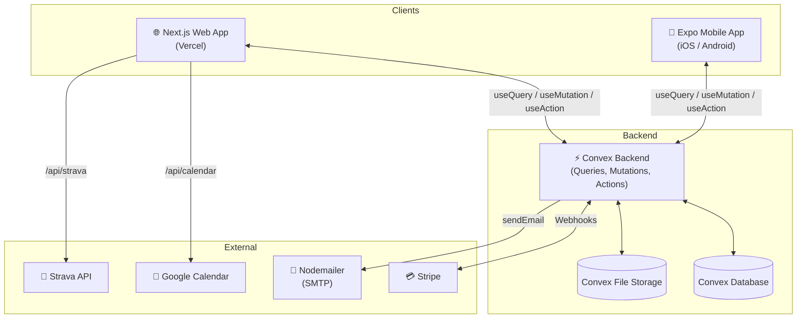

---

## 2. Tech Stack

| Layer | Technology |
|-------|-----------|
| **Web Frontend** | Next.js 13+ (App Router), TypeScript, Tailwind CSS, Heroicons |
| **Mobile Frontend** | React Native 0.83, Expo 55, TypeScript, Reanimated 4 |
| **Backend** | Convex (serverless functions, real-time database) |
| **Auth** | Custom session-based auth with bcrypt (12 salt rounds) |
| **Payments** | Stripe Checkout |
| **Email** | Nodemailer via SMTP |
| **Calendar** | Google Calendar ICS feed parsing |
| **Activity Tracking** | Strava API (OAuth2) |
| **Package Manager** | pnpm (workspace) |
| **Language** | Dutch (nl-BE locale) |

---

## 3. Backend (Convex)

### 3.1 Database Schema

```mermaid
erDiagram
    users {
        string email
        string passwordHash
        boolean emailVerified
        string name
        string firstName
        string lastName
        string phone
        string avatarUrl
        array roles
        boolean isActive
    }

    sessions {
        id userId
        string token
        number expiresAt
        string userAgent
    }

    contactMessages {
        string name
        string email
        string message
        boolean read
    }

    linedance_dances {
        string lesson_period
        number lesson_year
        string dance_name
        string song_name
        string song_artist
        string video_url
    }

    linedance_credits {
        id userId
        number balance
    }

    linedance_sessions {
        string date
        string startTime
        string endTime
        string location
        string qrToken
    }

    linedance_checkins {
        id userId
        id sessionId
        number creditsDeducted
    }

    linedance_credit_packages {
        string name
        number credits
        number priceInCents
        boolean isActive
    }

    linedance_credit_purchases {
        id userId
        id packageId
        number credits
        number amountPaidInCents
        string paymentMethod
    }

    ella_knutselen {
        string categorie
        string titel
        string youtube_url
        string beschrijving
    }

    ella_dinosaurs {
        number nummer
        string nederlandseNaam
        string wetenschappelijkeNaam
        string korteBeschrijving
        string leukWeetje
        id imageId
    }

    ella_planets {
        number nummer
        string nederlandseNaam
        string wetenschappelijkeNaam
        string korteBeschrijving
        id imageId
    }

    ella_game_scores {
        id userId
        string game
        number timeSeconds
        number moves
        number mistakes
        number correctAnswers
        number stars
        string difficulty
    }

    ella_memory_themes {
        string name
        string emoji
        array emojis
        boolean isActive
    }

    quizzes {
        string title
        string description
        boolean isActive
        string scoringMode
        id createdBy
    }

    quiz_rounds {
        id quizId
        string name
        string roundType
        number order
    }

    quiz_questions {
        id quizId
        string questionText
        string questionType
        string correctAnswer
        number points
        number timeLimitSeconds
    }

    quiz_sessions {
        id quizId
        string status
        string joinCode
        number currentQuestionIndex
    }

    quiz_participants {
        id sessionId
        id userId
        string displayName
        number totalScore
    }

    quiz_answers {
        id sessionId
        id questionId
        id participantId
        string answer
        boolean isCorrect
        number pointsAwarded
    }

    prono_competitions {
        string name
        string description
        string emoji
        boolean isActive
        string startDate
        string endDate
    }

    prono_matches {
        id competitionId
        string homeTeam
        string awayTeam
        string matchDate
        number homeScore
        number awayScore
        boolean isFinished
    }

    prono_predictions {
        id userId
        id matchId
        number homeScore
        number awayScore
        number pointsAwarded
    }

    prono_leaderboard {
        id competitionId
        id userId
        number totalPoints
        number exactPredictions
    }

    users ||--o{ sessions : "has"
    users ||--o| linedance_credits : "has balance"
    users ||--o{ linedance_checkins : "checks in"
    users ||--o{ linedance_credit_purchases : "purchases"
    users ||--o{ ella_game_scores : "plays"
    users ||--o{ prono_predictions : "predicts"
    users ||--o{ prono_leaderboard : "ranks"
    users ||--o{ quiz_participants : "joins"
    linedance_sessions ||--o{ linedance_checkins : "has"
    linedance_credit_packages ||--o{ linedance_credit_purchases : "sold as"
    quizzes ||--o{ quiz_rounds : "contains"
    quizzes ||--o{ quiz_questions : "contains"
    quizzes ||--o{ quiz_sessions : "runs as"
    quiz_sessions ||--o{ quiz_participants : "has"
    quiz_sessions ||--o{ quiz_answers : "collects"
    quiz_questions ||--o{ quiz_answers : "answered by"
    prono_competitions ||--o{ prono_matches : "contains"
    prono_matches ||--o{ prono_predictions : "predicted"
    prono_competitions ||--o{ prono_leaderboard : "tracks"
```

#### Table Summary

| Domain | Tables | Purpose |
|--------|--------|---------|
| **Auth & Users** | `users`, `sessions`, `emailVerificationTokens`, `passwordResetTokens` | User accounts, login sessions, email verification, password reset |
| **Contact** | `contactMessages` | Contact form submissions |
| **Linedance** | `linedance_dances`, `linedance_credits`, `linedance_sessions`, `linedance_checkins`, `linedance_credit_packages`, `linedance_credit_purchases` | Dance lesson management, credit system, QR check-ins |
| **ELLA** | `ella_knutselen`, `ella_dinosaurs`, `ella_planets`, `ella_puzzle_images`, `ella_game_settings`, `ella_rekenoefeningen_settings`, `ella_game_scores`, `ella_memory_themes` | Educational games, crafts, scores |
| **Buzz Quiz** | `quizzes`, `quiz_rounds`, `quiz_questions`, `quiz_sessions`, `quiz_participants`, `quiz_answers` | Real-time interactive quizzes |
| **Prono** | `prono_competitions`, `prono_matches`, `prono_predictions`, `prono_leaderboard` | Sports prediction game |

---

### 3.2 Authentication System

- **Password hashing**: bcrypt with 12 salt rounds (Node.js action runtime)
- **Sessions**: Token-based, stored in `sessions` table
  - 30 days expiry (remember me) or 24 hours (default)
  - Web: localStorage / Mobile: expo-secure-store
- **Email verification**: Token with 24-hour expiry, sent via nodemailer
- **Password reset**: Token with 1-hour expiry
- **Roles**: `admin`, `member`, `guest`, `lijndans`, `ella`, `prono` (stored as array)

**Key auth functions:**

| Function | Type | Purpose |
|----------|------|---------|
| `secureRegister` | Action | Hash password, create user |
| `secureLogin` | Action | Verify password, create session |
| `secureRegisterWithSession` | Action | Register + auto-login |
| `secureResetPassword` | Action | Hash new password, update user |
| `validateSession` | Query | Check session token validity |
| `login` / `logout` | Mutation | Session management |
| `verifyEmail` | Mutation | Mark email as verified |
| `createPasswordResetToken` | Mutation | Generate reset link |

---

### 3.3 API Functions by Module

| Module | Queries | Mutations | Actions | Purpose |
|--------|---------|-----------|---------|---------|
| `auth.ts` | `getUserByEmail`, `getUserById`, `validateSession` | `register`, `login`, `logout`, `createSession`, `verifyEmail`, `createEmailVerificationToken`, `createPasswordResetToken`, `resetPassword` | — | Core auth |
| `authActions.ts` | — | — | `secureRegister`, `secureLogin`, `secureRegisterWithSession`, `secureResetPassword` | Bcrypt server actions |
| `users.ts` | `getProfile`, `listUsers` | `updateProfile`, `updateUserRoles`, `deactivateUser`, `reactivateUser`, `adminUpdateUser` | — | User management |
| `contact.ts` | — | `submitContactMessage` | — | Contact form |
| `creditPackages.ts` | `listActive`, `listAll`, `get` | `create`, `update`, `deactivate` | — | Credit package CRUD |
| `danceCredits.ts` | `getBalance`, `getPurchaseHistory`, `getAllPurchases`, `getAllBalances`, `getAllLijndansUsers` | `addCredits`, `removeCredits` | — | Credit balance management |
| `danceCheckins.ts` | `getHistory`, `isCheckedIn` | `checkIn` | — | QR-based check-in |
| `danceSessions.ts` | `getByQrToken`, `getToday`, `list`, `get`, `getCheckinCount`, `getAttendees` | `create`, `regenerateQr`, `remove` | — | Dance session management |
| `lijndances.ts` | `getAllDances`, `getDancesByPeriodYear` | `addDance`, `updateDance`, `deleteDance` | — | Dance catalog |
| `knutselen.ts` | `getAll`, `getByCategorie`, `getCategoryCounts`, `getById` | `add`, `update`, `remove` | — | Craft videos |
| `dinosaurs.ts` | `getAll`, `getById` | `generateUploadUrl`, `setImage`, `removeImage`, `add`, `update`, `remove` | — | Dinosaur encyclopedia |
| `planets.ts` | `getAll`, `getById`, `getPuzzleSettings` | `generateUploadUrl`, `setImage`, `removeImage`, `add`, `update`, `remove`, `updatePuzzleSettings` | — | Planet encyclopedia |
| `ellaScores.ts` | `getMyScores`, `getAllMyScores`, `getLeaderboard`, `getMyStats`, `getAllScoresForGame` | `saveScore` | — | Game score tracking |
| `memoryGame.ts` | `getActiveThemes`, `getAllThemes` | `seedThemes`, `addTheme`, `updateTheme`, `deleteTheme` | — | Memory game themes |
| `quizzes.ts` | `listQuizzes`, `getSession`, `getLiveSessions`, ... | `createQuiz`, `deleteQuiz`, `createSession`, `joinSession`, ... | — | Real-time quiz system |
| `prono.ts` | `getCompetitions`, `getActiveCompetitions`, `getMatches`, `getMyPredictions`, `getLeaderboard` | `createCompetition`, `updateCompetition`, `createMatch`, `updateMatchResult`, `deleteMatch`, `savePrediction` | — | Prediction game |
| `stripe.ts` | — | — | `createCheckoutSession` | Stripe checkout |
| `http.ts` | — | — | (HTTP route) | Stripe webhook handler |
| `email.ts` | — | — | `sendEmail`, `sendVerificationEmail`, `sendPasswordResetEmail` | Email delivery |

---

## 4. Web Application (Next.js)

### 4.1 Route Map

```
/ ................................ Home page (hero video, mission cards, upcoming events)
├── (auth)/
│   ├── login/ ................... Login form
│   ├── register/ ................ Registration form
│   ├── forgot-password/ ......... Request password reset
│   ├── reset-password/ .......... Set new password (with token)
│   └── verify-email/ ............ Email verification (with token)
├── activiteiten/
│   ├── (index) .................. Activity hub (role-filtered cards)
│   ├── lijndansen/ .............. Linedance info + lesson material
│   ├── parelende-peloton/ ....... Cycling club (Strava integration)
│   ├── quiz/ .................... Static quiz archive (2023–2026)
│   ├── quizzen/ ................. Buzz Quiz (interactive, real-time)
│   ├── ella/ .................... ELLA educational hub (role-gated)
│   │   ├── knutselen/ .......... Craft video categories
│   │   ├── rekenen/ ............ Math games hub
│   │   ├── planeten/ ........... Planet puzzles
│   │   ├── resultaten/ ......... Scores & leaderboards
│   │   └── varia/ .............. Mixed games
│   └── prono/ ................... Sports predictions (role-gated)
├── contact/ ..................... Contact form
├── (dashboard)/
│   └── dashboard/ ............... Admin dashboard home
│       └── admin/
│           ├── users ............ User management
│           ├── linedance/
│           │   ├── credits ..... Credit management
│           │   └── sessions .... Session management
│           ├── ella/
│           │   ├── (index) ..... Knutselen admin
│           │   ├── rekenen ..... Math admin
│           │   ├── dinosaurussen Dino admin
│           │   ├── planeten .... Planet admin
│           │   └── memory ...... Memory theme admin
│           ├── quizzen ......... Quiz builder
│           └── prono ........... Competition admin
└── api/
    ├── calendar/ ................ Google Calendar ICS proxy
    └── strava/ .................. Strava activity feed
```

### 4.2 Layout Hierarchy

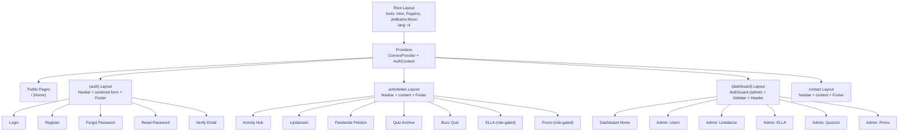

### 4.3 Public Pages

| Page | Key Features |
|------|-------------|
| **Home** (`/`) | Hero video banner, mission cards (nature preservation, wellness, culture), upcoming events from Google Calendar |
| **Contact** (`/contact`) | Name/email/message form → `api.contact.submitContactMessage`, social links (Instagram, Facebook) |
| **Lijndansen** (`/activiteiten/lijndansen`) | Info page: schedule (14u–15u), location (Sporthal Meermin, Waasmunster), pricing (€6/lesson or €25/5x), link to lesson material |
| **Parelende Peloton** (`/activiteiten/parelende-peloton`) | Strava ride feed with distance, duration, speed, formatted in Dutch |
| **Quiz Archive** (`/activiteiten/quiz`) | Year-based quiz editions (2023–2026) with gradient cards |

### 4.4 Auth Pages

All use the `(auth)` layout with `Navbar + centered form + Footer`.

| Page | Convex Functions Used |
|------|----------------------|
| **Login** | `api.authActions.secureLogin` → session token stored in localStorage |
| **Register** | `api.authActions.secureRegister` + `api.auth.createEmailVerificationToken` |
| **Forgot Password** | `api.auth.createPasswordResetToken` (silent success for security) |
| **Reset Password** | `api.authActions.secureResetPassword` (reads `?token=` from URL) |
| **Verify Email** | `api.auth.verifyEmail` (reads `?token=` from URL, auto-verifies on mount) |

### 4.5 Activity Pages

| Page | Access | Key Features |
|------|--------|-------------|
| **Activity Hub** | Public (some cards role-gated) | Grid of activity cards; ELLA visible to `admin`/`ella`; Prono visible to `admin`/`prono` |
| **Buzz Quiz** (`/activiteiten/quizzen`) | Public | List quizzes, admin can create/delete, start live sessions |
| **ELLA** (`/activiteiten/ella`) | `admin` or `ella` | Hub with 5 sections: Knutselen, Rekenen, Planeten, Resultaten, Varia |
| **Knutselen** | `admin` or `ella` | 7 craft categories with video counts from `api.knutselen.getCategoryCounts` |
| **Prono** (`/activiteiten/prono`) | `admin` or `prono` | Active competitions list → match predictions with leaderboard |

### 4.6 Dashboard (Admin)

Protected by `<AuthGuard requireAdmin>` — redirects non-admins to `/login`.

**Sidebar navigation sections:**

| Section | Routes | Purpose |
|---------|--------|---------|
| **General** | `/dashboard`, `/dashboard/members`, `/dashboard/profile` | Overview, member list, profile |
| **Gebruikers** | `/dashboard/admin/users` | User CRUD, role assignment, activate/deactivate |
| **Lijndans** | `/dashboard/admin/linedance/credits`, `…/sessions` | Manage credits, create sessions, view attendance |
| **ELLA** | `/dashboard/admin/ella`, `…/rekenen`, `…/dinosaurussen`, `…/planeten`, `…/memory` | Manage craft videos, math settings, dino/planet encyclopedia, memory themes |
| **Buzz Quiz** | `/dashboard/admin/quizzen` | Create quizzes, add rounds/questions, manage sessions |
| **Prono** | `/dashboard/admin/prono` | Create competitions, add matches, enter results |

### 4.7 API Routes

| Endpoint | Method | Purpose |
|----------|--------|---------|
| `/api/calendar?month=M&year=Y` | GET | Fetches Google Calendar ICS, parses VEVENTs, expands recurring rules, returns JSON events |
| `/api/strava` | GET | Fetches BuitenZijn club rides from Strava API (OAuth2 token refresh), returns up to 30 activities |
| Convex HTTP: `/stripe-webhook` | POST | Processes Stripe `checkout.session.completed` events, adds dance credits to user |

---

## 5. Mobile Application (React Native / Expo)

### 5.1 Navigation Structure

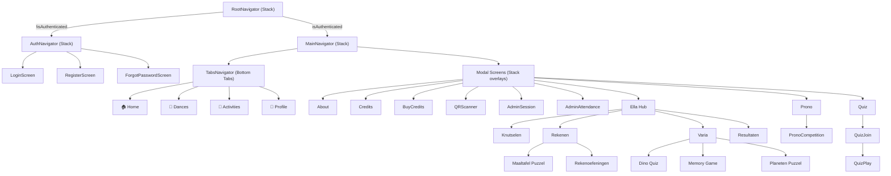

### 5.2 Screens Overview

| Tab | Screen | Key Features |
|-----|--------|-------------|
| **Home** | `HomeScreen` | Personalized greeting (time-of-day), role-based activity cards, live quiz banner |
| **Dances** | `DancesScreen` | Full dance catalog with search, filter (year/period), sort, YouTube player, admin edit mode |
| **Activities** | `ActivitiesScreen` | Activity grid (Lijndansen, Peloton, Quiz, Buzz Quiz, Prono), social links |
| **Profile** | `ProfileScreen` | Avatar, user info, roles display, sign-out |

| Modal Screen | Purpose |
|--------------|---------|
| `CreditsScreen` | Dance credit balance, purchase history, check-in history |
| `BuyCreditsScreen` | Browse credit packages, Stripe checkout (opens browser) |
| `QRScannerScreen` | Scan session QR code → `api.danceCheckins.checkIn` → deducts 1 credit |
| `AdminSessionScreen` | Create dance sessions, regenerate QR codes |
| `AdminAttendanceScreen` | View attendees for a specific session |
| `AboutScreen` | Mission info, activity links, social media |

### 5.3 ELLA Educational Games

Access: `ella` or `admin` role required.

| Game | Screen | Mechanics |
|------|--------|-----------|
| **Knutselen** | `EllaKnutselenScreen` | 7 craft categories → YouTube tutorial videos |
| **Maaltafel Puzzel** | `EllaMaaltafelPuzzelScreen` | Fill blanks in multiplication grid, sound effects, bomb animation on wrong answer |
| **Rekenoefeningen** | `EllaRekenoefenScreen` | Math exercises (add/sub/mul/div/fractions) with difficulty levels, time limits, star scoring |
| **Dino Quiz** | `EllaDinoQuizScreen` | Show dinosaur image → pick correct name from 3 choices |
| **Memory Game** | `EllaMemoryScreen` | Emoji-themed card matching (pairs or triples), configurable grid sizes |
| **Planeten Puzzel** | `EllaPlanetPuzzelScreen` | 15-puzzle sliding game with planet images, 3×3 to 7×7 grids |

All games save scores via `api.ellaScores.saveScore` and display results/leaderboards in `EllaResultatenScreen`.

### 5.4 Buzz Quiz (Real-time)

| Step | Screen | Function |
|------|--------|----------|
| Join | `QuizJoinScreen` | Enter join code + display name → `api.quizzes.joinSession` |
| Play | `QuizPlayScreen` | Multiple question types: multiple choice, text input, ranking (drag & drop), geo (Leaflet map via WebView), image selection |

### 5.5 Prono (Predictions)

| Screen | Features |
|--------|----------|
| `PronoScreen` | List active competitions |
| `PronoCompetitionScreen` | Match list with prediction inputs (home/away scores), leaderboard tab |

---

## 6. Flow Charts

### 6.1 Authentication Flow

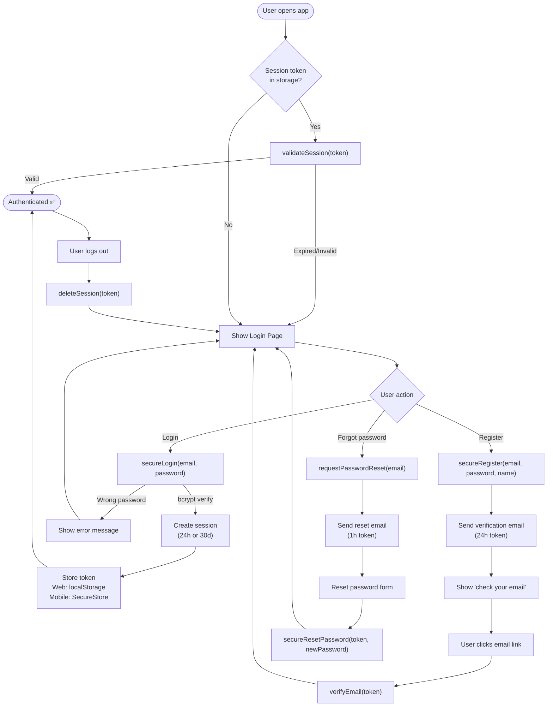

### 6.2 Linedance Credit & Check-in Flow

```mermaid
flowchart TD
    subgraph Admin
        CREATE_SESSION["Admin creates session<br/>date, time, location"]
        CREATE_SESSION --> QR["Generate QR token<br/>(random, expires 23:59)"]
        QR --> DISPLAY["Display QR code<br/>at session venue"]
    end

    subgraph "Credit Purchase"
        BUY["User selects<br/>credit package"]
        BUY --> STRIPE["Stripe Checkout"]
        STRIPE -->|Payment success| WEBHOOK["Stripe webhook<br/>/stripe-webhook"]
        WEBHOOK --> ADD["internalAddCredits<br/>(userId, credits)"]
        ADD --> BALANCE["Balance updated ✅"]

        ADMIN_ADD["Admin adds credits<br/>manually (cash/manual)"]
        ADMIN_ADD --> BALANCE
    end

    subgraph "Check-in Flow (Mobile)"
        SCAN["User scans QR code<br/>(expo-camera)"]
        SCAN --> CHECKIN["checkIn(userId, qrToken)"]
        CHECKIN --> VALID{QR valid &<br/>not expired?}
        VALID -->|No| FAIL["Error: invalid QR ❌"]
        VALID -->|Yes| CREDITS_CHECK{Balance ≥ 1?}
        CREDITS_CHECK -->|No| NO_CREDITS["Error: no credits ❌"]
        CREDITS_CHECK -->|Yes| ALREADY{Already<br/>checked in?}
        ALREADY -->|Yes| DUPLICATE["Error: already<br/>checked in ❌"]
        ALREADY -->|No| DEDUCT["Deduct 1 credit"]
        DEDUCT --> RECORD["Record check-in"]
        RECORD --> SUCCESS["Success ✅<br/>Show new balance"]
    end
```

### 6.3 Buzz Quiz Session Flow

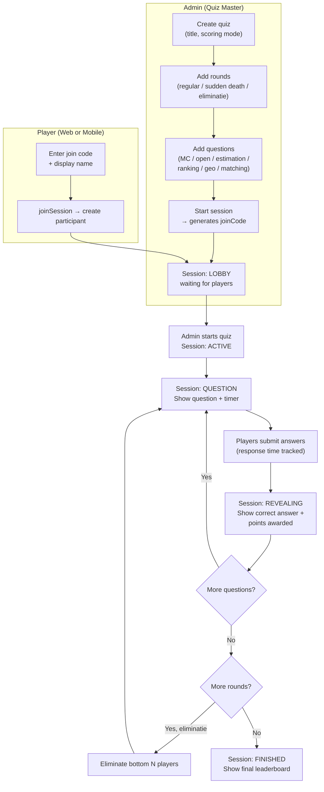

### 6.4 Prono Prediction Flow

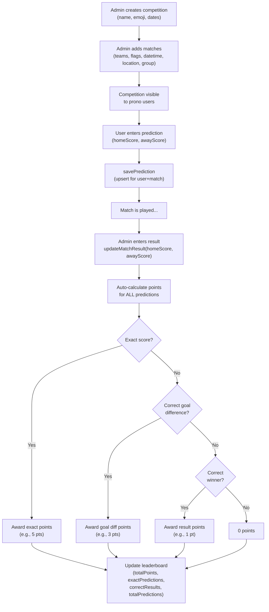

### 6.5 ELLA Games Flow

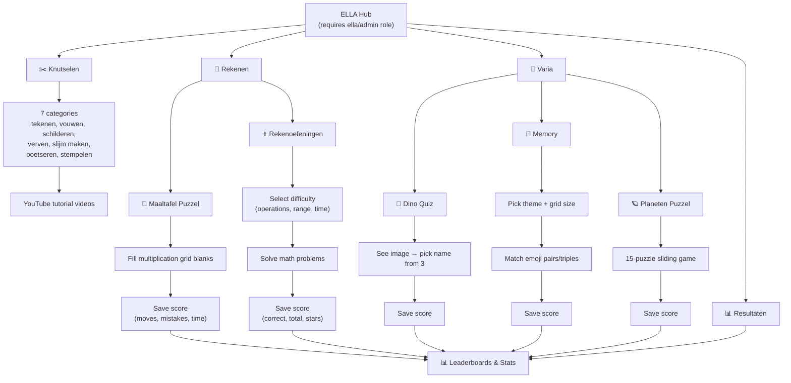

### 6.6 Stripe Payment Flow

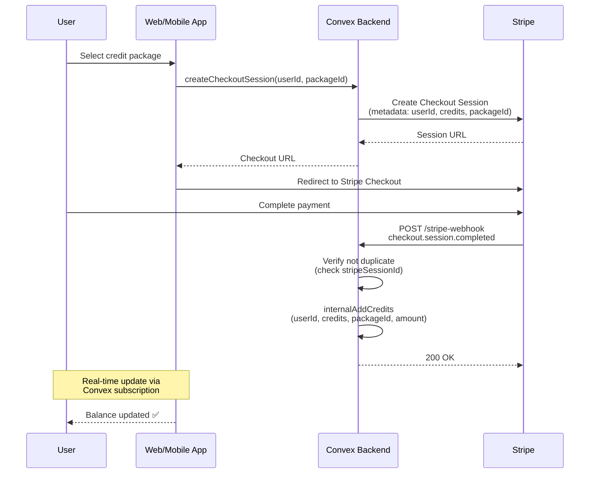

### 6.7 Contact Form Flow

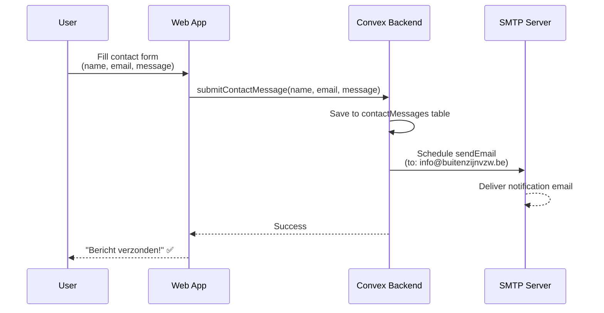

---

## 7. Role-Based Access Control

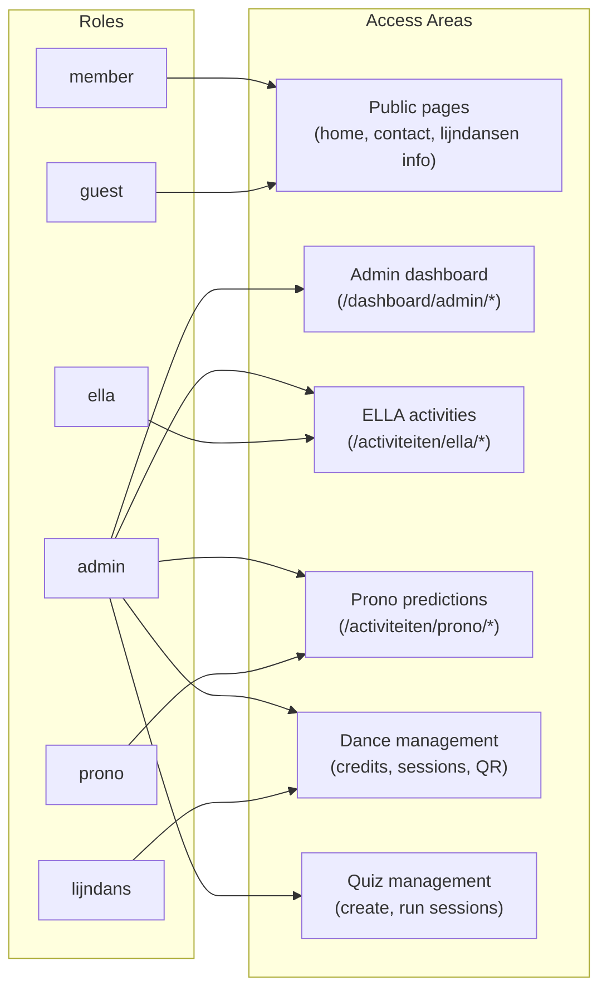

| Role | Permissions |
|------|------------|
| `admin` | Full access: dashboard, all activities, user management, all CRUD operations |
| `member` | Public pages, profile, basic activity participation |
| `guest` | Public pages only |
| `lijndans` | Dance credits, check-in, session attendance |
| `ella` | ELLA educational games and scores |
| `prono` | Sports prediction competitions |

Users can have **multiple roles** (stored as array). Access checks use `roles.includes("role")`.

---

## 8. Web vs Mobile Feature Matrix

| Feature | Web | Mobile | Notes |
|---------|:---:|:------:|-------|
| **Authentication** | ✅ | ✅ | Web: localStorage, Mobile: expo-secure-store |
| **Home / Landing** | ✅ Hero video + events | ✅ Personalized greeting | Web has Google Calendar integration |
| **Linedance Info** | ✅ Static info page | — | Web only |
| **Linedance Catalog** | — | ✅ Search, filter, YouTube | Mobile has richer UX |
| **Dance Credits** | ✅ Purchase via Stripe | ✅ Purchase + QR check-in | Mobile has QR scanner |
| **QR Check-in** | — | ✅ Camera scanner | Mobile exclusive |
| **Admin: Sessions** | ✅ | ✅ | Both can create/manage |
| **Admin: Dashboard** | ✅ Full sidebar nav | — | Web only |
| **ELLA Games** | ✅ Hub + Knutselen | ✅ All 6 games | Mobile has full game implementations |
| **Buzz Quiz** | ✅ Create + play | ✅ Join + play | Web for admin, both for playing |
| **Prono** | ✅ | ✅ | Feature parity |
| **Parelende Peloton** | ✅ Strava feed | ✅ External link | Web shows rides, mobile links out |
| **Contact Form** | ✅ | — | Web only |
| **Google Calendar** | ✅ Upcoming events | — | Web only |
| **About / Mission** | ✅ Home page | ✅ About screen | Different presentations |

---

## 9. External Integrations

| Service | Purpose | Integration Point |
|---------|---------|-------------------|
| **Stripe** | Dance credit purchases | `createCheckoutSession` action + `/stripe-webhook` HTTP endpoint |
| **Google Calendar** | Upcoming community events | `/api/calendar` Next.js route (ICS parsing) |
| **Strava** | Cycling activity feed | `/api/strava` Next.js route (OAuth2 token refresh) |
| **Nodemailer (SMTP)** | Email verification, password reset, contact notifications | `email.ts` internal actions |
| **YouTube** | Craft tutorial videos, dance lesson videos | Embedded player (web iframe / mobile WebView) |

---

*Generated on 2025-04-10. This document covers the full BuitenZijn monorepo including the Next.js web app, React Native mobile app, and Convex backend.*
